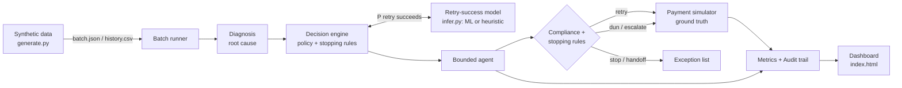

# RetryBrain

**An agentic revenue-recovery engine.** Razorpay Buildathon · Track 03: AI Revenue Recovery.
*Payment failure → root cause → the right intervention → a bounded recovery workflow → measured money recovered.*

RetryBrain **detects** revenue at risk (failed payments), **diagnoses** the root cause, **decides** the right intervention using an ML retry-success score plus an explicit policy, and **executes a bounded recovery workflow** — smart-timed retries and compliant, escalating dunning — governed by **stopping rules** and recorded in a full **audit trail**. It reports **money recovered across a 50+ record batch measured against a naive baseline**, with an **honest list of what it could not recover**.

## Measured results

On a seeded synthetic batch of **60 failed payments (₹99,470 at risk)**, comparing RetryBrain's bounded workflow to the naive baseline every payment gateway already does (*retry once, immediately*):

| Metric | Naive baseline | **RetryBrain** | Uplift |
|---|---|---|---|
| Payments recovered | 25 / 60 (41.7%) | **54 / 60 (90.0%)** | **+29 payments** |
| Money recovered | ₹58,086 | **₹93,472** | **+₹35,386** |
| Recovery rate | 41.7% | **90.0%** | **+48.3 pts** |
| Unresolved (exceptions) | — | **6, listed honestly** | — |

**Recovered by failure cause** (RetryBrain vs. baseline) — this is where the intelligence shows:

| Failure cause | RetryBrain | Baseline | Why RetryBrain wins |
|---|---|---|---|
| `insufficient_funds` | 19/19 | 10 | retries at the **next-morning** top-up window, not at the failure hour |
| `bank_downtime` | 7/7 | 3 | waits out the **downtime window** before retrying |
| `expired_card` | 7/9 | 0 | **never blind-retries** — switches method via compliant dunning |
| `do_not_honor` | 8/10 | 5 | nudges the customer instead of burning retries |
| `3ds_failure` | 3/5 | 0 | bounded retries with an auth nudge |
| `network_error` | 7/7 | 7 | correctly a **tie** — a fast retry is already optimal |
| `other` | 3/3 | 0 | conservative retry/nudge |

> These numbers are reproducible: `python -m backend.runner`. They were produced with the **domain-heuristic scorer** (see below); training the ML model refines the score but the pipeline, policy, and workflow are identical. Re-running after `python -m backend.model.train` swaps the heuristic for the learned model automatically.

## How it works



**Two AI layers.** (1) A **retry-success model** (`backend/model/`) scores `P(retry succeeds)` from the event's features; it's a scikit-learn pipeline (one-hot + logistic regression / gradient boosting) trained on `history.csv`, with a domain-heuristic fallback so the system runs with zero ML dependencies. (2) A **decision policy** (`backend/decision_engine.py`) turns that score into an action: `retry` (at an optimal time), `dun`, `switch_method`, or `stop`.

**We score the retry we're *about to perform*, not the past failure.** The model is trained on failure-time features, but the runner asks it "will the retry I'm scheduling — next morning for a top-up, or after the downtime window — succeed?" (`_retry_conditioned_score`). This is the correct way to gate a decision on a predictive model, and it keeps the *learned score* (not a hard-coded rule) in charge of retry-vs-nudge.

**The workflow is bounded three ways.** The retry cap (`MAX_ATTEMPTS`), the escalation ladder ending in `human_handoff`, and a hard step guard. Every decision and action is written to an append-only **audit trail**, so each recovery is fully explainable — the property Track 03 prizes ("verification, not generation, is the bottleneck").

**Compliance is first-class.** No contact for customers on DND/opt-out, quiet-hours awareness (21:00–08:00), and a defined escalation ladder (`reminder → alternate_method → final_notice → human_handoff`). A silent retry is still allowed for a DND customer; a *message* is not.

**Honest measurement.** The `backend/simulator.py` oracle — never seen by the model — decides whether each action actually recovers the money, so the reported recovery is earned, not assumed. The baseline uses the same seeded oracle.

## Quickstart

**Option A — zero-dependency demo (no install needed):**

```bash
python data/generate.py      # writes data/history.csv (1500 rows) + data/batch.json (60)
python serve_demo.py         # -> open http://127.0.0.1:8000/  (live dashboard, stdlib only)
```

**Option B — full API + trained model:**

```bash
pip install -r requirements.txt
python data/generate.py
python -m backend.model.train        # trains the model, prints ROC-AUC, saves retry_model.pkl
python -m backend.runner             # prints the measured scoreboard vs. baseline
uvicorn backend.main:app --port 8000 # -> dashboard at / , OpenAPI docs at /docs
pytest -q                            # decision policy, compliance, and runner tests
```

**Key endpoints:** `GET /metrics`, `GET /results`, `GET /audit/{payment_id}`, `POST /events/payment-failed` (runs the full workflow for one event), `POST /run-batch`.

## Repo layout

```
backend/
  main.py            FastAPI app: full pipeline + serves the dashboard
  runner.py          bounded recovery workflow + baseline + batch measurement
  decision_engine.py policy: retry|dun|switch_method|stop, optimal retry timing
  diagnosis.py       failure_code -> root cause + suggested action
  agent/agent.py     executes one bounded step; template dunning (LLM-ready)
  agent/compliance.py DND, quiet hours, escalation ladder
  model/             features, train (sklearn), infer (model or heuristic)
  simulator.py       ground-truth oracle (kept separate from the model)
  metrics.py         money recovered, rates, per-cause breakdown, exceptions
  store.py           shared audit + results; snapshots data/last_run.json
  audit.py           append-only audit trail
data/generate.py     pure-stdlib synthetic data engine
frontend/index.html  self-contained dashboard (Chart.js)
serve_demo.py        zero-dependency demo server
tests/               decision engine, compliance, runner
```

## Notes for the interview

- **Why the baseline is fair:** it's exactly what a gateway does today (one immediate retry), run against the same oracle and seed.
- **Why 90% and not 100%:** the exception list is real — expired cards where the customer never updates, do-not-honor declines that exhaust the ladder, 3DS drops that hit the retry cap. Those hand off to a human.
- **What's synthetic and what isn't:** the *outcomes* are simulated (no real PSP), but the *architecture, policy, compliance, and measurement* are production-shaped. Swapping the simulator for a real gateway and the templates for an LLM are isolated changes.
- **Tunable levers to defend:** `RETRY_THRESHOLD` (recovery-vs-cost), `MAX_ATTEMPTS`, and the per-cause timing rules in `optimal_retry`.

## Tech

Python · FastAPI · scikit-learn · Chart.js · pure-stdlib data generator & demo server · provider-agnostic LLM hook for dunning.
