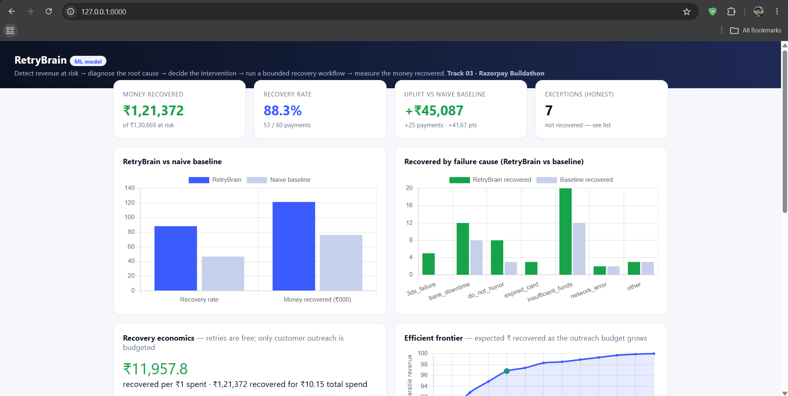
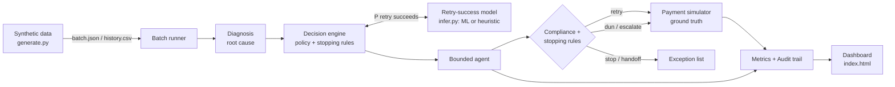

# RetryBrain

**An agentic revenue-recovery engine.** Razorpay Buildathon · Track 03: AI Revenue Recovery.
*Payment failure → root cause → the right intervention → a bounded recovery workflow → measured money recovered.*

RetryBrain **detects** revenue at risk (failed payments), **diagnoses** the root cause, **decides** the right intervention using an ML retry-success score plus an explicit policy, and **executes a bounded recovery workflow** — smart-timed retries and compliant, escalating dunning — governed by **stopping rules** and recorded in a full **audit trail**. It treats recovery as a **budget-constrained ROI problem** (retries are free; customer outreach is rationed to where it pays off) and reports **money recovered across a 50+ record batch measured against a naive baseline**, with an **honest list of what it could not recover** — a lift that holds across five random seeds, not one lucky batch.



*The live dashboard — money recovered vs. total at risk, RetryBrain vs. the naive baseline, recovery by failure cause, the full recovery ledger, and a click-through audit trail for every payment.*

## Measured results

On a seeded synthetic batch of **60 failed payments (₹130,669 at risk)**, comparing RetryBrain's bounded workflow to the naive baseline every payment gateway already does (*retry once, immediately*):

| Metric | Naive baseline | **RetryBrain** | Uplift |
|---|---|---|---|
| Payments recovered | 28 / 60 (46.7%) | **53 / 60 (88.3%)** | **+25 payments** |
| Money recovered | ₹76,285 | **₹121,372** | **+₹45,087** |
| Recovery rate | 46.7% | **88.3%** | **+41.7 pts** |
| Unresolved (exceptions) | — | **7, listed honestly** | — |

**Recovered by failure cause** (RetryBrain vs. baseline) — this is where the intelligence shows:

| Failure cause | RetryBrain | Baseline | Why RetryBrain wins |
|---|---|---|---|
| `insufficient_funds` | 20/21 | 12 | retries at the **next-morning** top-up window, not at the failure hour |
| `bank_downtime` | 12/12 | 8 | waits out the **downtime window** before retrying |
| `expired_card` | 3/7 | 0 | **never blind-retries** — switches method via compliant dunning |
| `do_not_honor` | 8/8 | 3 | nudges the customer instead of burning retries |
| `3ds_failure` | 5/5 | 0 | bounded retries with an auth nudge |
| `network_error` | 2/2 | 2 | correctly a **tie** — a fast retry is already optimal |
| `other` | 3/5 | 3 | conservative retry/nudge |

> These are the **trained-model** numbers (dashboard badge: *ML model*), reproducible with `python -m backend.model.train` then `python -m backend.runner`. The system also ships a **domain-heuristic fallback** so it runs with zero ML dependencies; on this synthetic batch the heuristic edges it (54/60, 90.0%) because it encodes strong hand-tuned priors, while the learned model is what generalizes to real-world data. Both far exceed the 46.7% baseline.

### Retry-success model — held-out performance

`python -m backend.model.train` trains the retry-success model and evaluates it on a held-out test split it never saw during training. Best model: **logistic regression, ROC-AUC = 0.793** — clear separation between retries that will and won't succeed (0.5 = coin-flip, 1.0 = perfect).

| Class | Precision | Recall | F1 | Support |
|---|---|---|---|---|
| `0` — retry fails | 0.768 | 0.852 | 0.808 | 244 |
| `1` — retry succeeds | 0.654 | 0.519 | 0.579 | 131 |
| **Accuracy** | | | **0.736** | 375 |
| Macro avg | 0.711 | 0.686 | 0.693 | 375 |
| Weighted avg | 0.728 | 0.736 | 0.728 | 375 |

**ROC-AUC (0.793) is the metric that matters here**, because the model is used to *rank and gate* recovery decisions, not to make a hard yes/no call. The decision engine applies its own `RETRY_THRESHOLD` (0.35) — deliberately below 0.5 — so it still attempts retries the model rates as *moderately* likely rather than only near-certain ones (the report above is at the default 0.5 cut, for reference). That's why AUC, not raw accuracy, is the honest headline for a gating model.

## Recovery economics — spend where it pays off

Recovering revenue is not free. A gateway **retry** is an effectively-free re-attempt, but **contacting a customer** (a WhatsApp template, a transactional email) costs real money per message. At scale you cannot nudge everyone, so recovery becomes a **budget-allocation problem**: spend each scarce outreach rupee where its *expected* return is highest. `backend/economics.py` makes that cost model explicit and turns the batch into an ROI-ranked portfolio.

The allocator ranks every failed payment by expected ROI — `P(a nudge converts | root cause) × amount ÷ message cost` — using **documented domain priors, not the simulator's answer key** (it is being tested, not fed the oracle). It funds outreach top-down until the budget is exhausted; unfunded low-ROI failures fall through to the free retry only, and if that misses they land in the honest exception list. Free retries are never gated. `python -m backend.runner` prints the economics block:

```
RECOVERY ECONOMICS  (retries are free; only customer outreach is budgeted)
Free retries alone   : 39 recovered, ₹89,577.56 at ₹0.00 outreach
+ compliant outreach : 53 recovered, ₹121,372.08 (outreach ₹9.25 on 45 messages)
Outreach lift        : +14 payments, +₹31,794.52 for ₹9.25  ->  ~₹3,437 recovered per ₹1 of outreach
Total workflow spend : ₹10.15 (₹0.90 retries + ₹9.25 outreach)  ->  ROI ~₹11,958 per ₹1
```

The honest reading, with consistent denominators. **Free retries do the heavy lifting** — they alone recover ₹89.6K of the ₹121K, at zero outreach cost. **Outreach is a cheap, high-ROI top-up, not the main engine**: ₹9.25 of messaging lifts recovery by ₹31,795 (+14 payments) — about ₹3,437 recovered per ₹1 of *outreach*, on top of a total-workflow ROI of ~₹11,958 per ₹1. That reframing is the whole point of the layer: don't message everyone, spend outreach only where it beats a free retry.

**The efficient frontier shows diminishing returns.** An analytic sweep of *expected* recovery vs. outreach budget (using the priors, never the oracle) rises steeply then flattens, because the allocator funds the highest-ROI nudges first — so it's monotonic *by construction* and unit-tested as such. On this batch, ~95% of the **expected** recoverable maximum is reached at ₹1.30 of outreach; running the pipeline for real at that ₹1.30 budget recovers ₹110,278 — **91% of the fully-funded revenue for 14% of the outreach spend.** A finance team reads that curve to pick the cut where the last rupees still pay off. *(Figures are from the trained-model run shown on the dashboard; the ROI is order-of-thousands-to-one in both scoring modes.)*

## Robustness — not one lucky seed

A single seeded batch invites the fair objection *"you tuned to that seed."* `python -m backend.runner --robust` re-runs the **same policy** against **freshly generated batches across five seeds** and reports the spread, so the uplift is shown to be a property of the policy, not the fixture:

| | seed 42 | seed 7 | seed 13 | seed 99 | seed 2024 |
|---|---|---|---|---|---|
| RetryBrain | 88.3% | 83.3% | 80.0% | 86.7% | 83.3% |
| Baseline | 46.7% | 48.3% | 45.0% | 45.0% | 46.7% |
| **Uplift (pts)** | **+41.7** | **+35.0** | **+35.0** | **+41.7** | **+36.7** |

**Every seed is +35 points or better; mean +38.0 pts (+₹40,689 recovered).** The lift never collapses on an unseen batch — the anti-cherry-pick evidence. *(Trained-model run; reproduce with `python -m backend.runner --robust`.)*

## How it works



**Two AI layers — predictive and generative.** (1) A **retry-success model** (`backend/model/`) scores `P(retry succeeds)` from the event's features; it's a scikit-learn pipeline (one-hot + logistic regression / gradient boosting) trained on `history.csv`, with a domain-heuristic fallback so the system runs with zero ML dependencies. (2) When a recovery step contacts the customer, the message is **LLM-written** (`backend/agent/agent.py`, provider-agnostic — OpenAI / Anthropic / Gemini via a key in `.env`), fenced by a system prompt and a length cap, with the deterministic template as an automatic fallback so it still runs fully offline. Between the two sits an explicit **decision policy** (`backend/decision_engine.py`) that turns the score into an action — `retry` (at an optimal time), `dun`, `switch_method`, or `stop` — and picks *when* to act.

**We score the retry we're *about to perform*, not the past failure.** The model is trained on failure-time features, but the runner asks it "will the retry I'm scheduling — next morning for a top-up, or after the downtime window — succeed?" (`_retry_conditioned_score`). This is the correct way to gate a decision on a predictive model, and it keeps the *learned score* (not a hard-coded rule) in charge of retry-vs-nudge.

**The workflow is bounded three ways.** The retry cap (`MAX_ATTEMPTS`), the escalation ladder ending in `human_handoff`, and a hard step guard. Every decision and action is written to an append-only **audit trail**, so each recovery is fully explainable — the property Track 03 prizes ("verification, not generation, is the bottleneck").

**Compliance is first-class.** No contact for customers on DND/opt-out, quiet-hours awareness (21:00–08:00), and a defined escalation ladder (`reminder → alternate_method → final_notice → human_handoff`). A silent retry is still allowed for a DND customer; a *message* is not — and because the LLM only runs *after* this compliance gate, it can never draft a message we aren't allowed to send.

**Honest measurement.** The `backend/simulator.py` oracle — never seen by the model — decides whether each action actually recovers the money, so the reported recovery is earned, not assumed. The baseline uses the same seeded oracle.

## Quickstart

**Option A — zero-dependency demo (no install needed):**

```bash
python data/generate.py      # writes data/history.csv (1500 rows) + data/batch.json (60)
python serve_demo.py         # -> open http://127.0.0.1:8000/  (live dashboard, stdlib only)
```

**Option B — full API + trained model:**

```bash
pip install -r requirements.txt
python data/generate.py
python -m backend.model.train        # trains the model, prints ROC-AUC, saves retry_model.pkl
python -m backend.runner             # prints the measured scoreboard vs. baseline
uvicorn backend.main:app --port 8000 # -> dashboard at / , OpenAPI docs at /docs
pytest -q                            # decision policy, compliance, and runner tests
```

*Optional — LLM-written messages:* copy `.env.example` to `.env` and set one provider key (`OPENAI_API_KEY`, `ANTHROPIC_API_KEY`, or `GEMINI_API_KEY`) to have dunning messages written by an LLM. With no key set, the system uses deterministic templates and needs no extra install.

**Key endpoints:** `GET /metrics`, `GET /results`, `GET /audit/{payment_id}`, `POST /events/payment-failed` (runs the full workflow for one event), `POST /run-batch`.

## Repo layout

```
backend/
  main.py            FastAPI app: full pipeline + serves the dashboard
  runner.py          bounded recovery workflow + baseline + batch measurement
  decision_engine.py policy: retry|dun|switch_method|stop, optimal retry timing
  diagnosis.py       failure_code -> root cause + suggested action
  agent/agent.py     executes one bounded step; LLM-written dunning + template fallback
  agent/compliance.py DND, quiet hours, escalation ladder
  model/             features, train (sklearn), infer (model or heuristic)
  simulator.py       ground-truth oracle (kept separate from the model)
  economics.py       per-action costs + ROI-ranked, budget-constrained allocation
  metrics.py         money recovered, rates, per-cause breakdown, exceptions
  store.py           shared audit + results; snapshots data/last_run.json
  audit.py           append-only audit trail
data/generate.py     pure-stdlib synthetic data engine
frontend/index.html  self-contained dashboard (Chart.js)
serve_demo.py        zero-dependency demo server
tests/               decision engine, compliance, runner, economics/budget
```

## Notes for the interview

- **Why the baseline is fair:** it's exactly what a gateway does today (one immediate retry), run against the same oracle and seed.
- **Why 88% and not 100%:** the 7-item exception list is real — four expired-card declines where the customer never completes the alternate-method flow (one is on DND, so no contact is allowed), one insufficient-funds payment that hit the max-attempts cap, and two `other` declines. Those are handed to a human, not silently dropped.
- **What's synthetic and what isn't:** the *outcomes* are simulated (no real PSP), but the *architecture, policy, compliance, measurement, and LLM-written dunning* are production-shaped. The dunning messages are generated by a real, provider-agnostic LLM (with a template fallback); swapping the simulator for a real gateway is the one remaining isolated change.
- **Tunable levers to defend:** `RETRY_THRESHOLD` (recovery-vs-cost), `MAX_ATTEMPTS`, and the per-cause timing rules in `optimal_retry`.
- **Why the economics layer matters:** it reframes recovery as spending a scarce outreach budget by ROI, not "message everyone." The costs and conversion priors in `economics.py` are *stated assumptions* a finance team would negotiate — deliberately kept separate from the oracle, so the allocator is tested rather than handed the answer. Ask me to change a price and the frontier moves live.
- **Why the frontier is trustworthy:** expected recovery is monotonic in budget *by construction* (the allocator only ever adds the next-best nudge), and that property is unit-tested — so the diminishing-returns curve can't be an artifact of a lucky run.
- **Why I trust the uplift:** `--robust` regenerates the batch across five seeds and every one clears +35 points — the number is a property of the policy, not the seed.

## Tech

Python · FastAPI · scikit-learn · Chart.js · pure-stdlib data generator & demo server · provider-agnostic LLM (OpenAI / Anthropic / Gemini) for dunning, with a template fallback.
